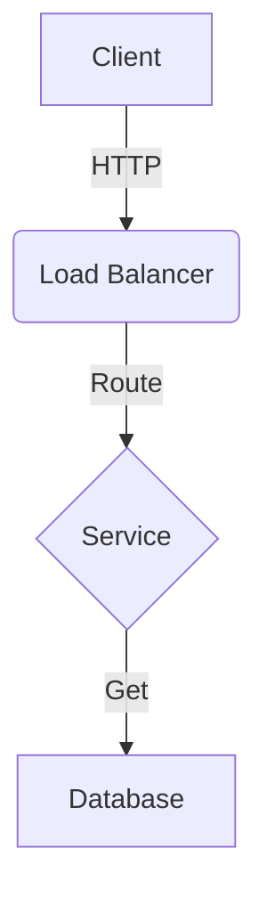

# Content & Structure Guidelines

This guide explains how to organize your files and write content that leverages XeoContext's rendering features.

## Repository Structure

> **Note:** This structure follows Domain-Driven Design (DDD) principles.

The content is located at the **repository root**. It follows a strict separation between **Global Architecture** and **Bounded Contexts (Domains)**.

```text
.
├── docker-compose.yml            # Orchestration to run the viewer locally.
├── xeocontext.config.json        # [MANDATORY] The central navigation and metadata map.
├── global/                       # [MANDATORY] Cross-cutting architectural decisions & Master Roots.
│   ├── gateway/                  # Unified System API (Master Roots).
│   │   ├── openapi.yaml          # Master REST API definition.
│   │   └── asyncapi.yaml         # Master Event definition.
│   ├── adrs/                     # Architecture Decision Records.
│   └── standards/                # Coding conventions, API guidelines, etc.
└── domains/                      # [MANDATORY] Business Logic Modules.
    ├── {domain-name}/            # (e.g., identity, payments)
    │   ├── readme.md             # Domain overview.
    │   ├── openapi.yaml          # Domain-specific REST API.
    │   └── asyncapi.yaml         # Domain-specific Event API.
```

## System Design (Markdown)

XeoContext uses a robust Markdown renderer with support for GitHub Flavored Markdown (GFM).

### Diagrams (Mermaid)

You can write Mermaid diagrams directly in your markdown using code blocks with the `mermaid` language.



### Code Blocks

Standard code highlighting is supported.

```typescript
interface User {
  id: string;
  name: string;
}
```

### Inline Code

Use backticks for inline commands or references, e.g., `GET /users`.

### Headings

Use standard `# H1`, `## H2`, `### H3` tags. The application automatically generates a **Table of Contents (TOC)** based on these headers.

## APIs

### OpenAPI

Your OpenAPI 3.0+ file (YAML or JSON) is rendered using Swagger UI. This provides an interactive console for your API consumers.

### AsyncAPI

Your AsyncAPI 2.0+ file is rendered using a unified AsyncAPI component, perfect for visualizing message-driven architectures (Channels, Subscribe/Publish operations).

## Content Validation

It is recommended to validate your spec files before committing changes to ensure the viewer renders them correctly.

### OpenAPI Validation

You can use [Redocly CLI](https://redocly.com/docs/cli/) to lint and bundle your OpenAPI definitions.

```bash
# Lint the main gateway file (and all its references)
pnpm dlx @redocly/cli lint content/global/gateway/openapi.yaml

# Lint a specific domain file
pnpm dlx @redocly/cli lint content/domains/identity/components/paths/auth_login.yaml
```

### AsyncAPI Validation

You can use [AsyncAPI CLI](https://www.asyncapi.com/docs/tools/cli) to validate your AsyncAPI definitions.

```bash
# Validate the main gateway file
pnpm dlx @asyncapi/cli validate content/global/gateway/asyncapi.yaml
```
